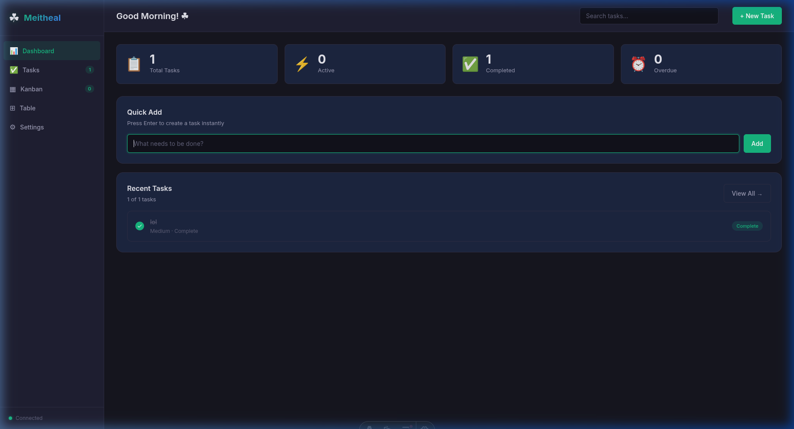
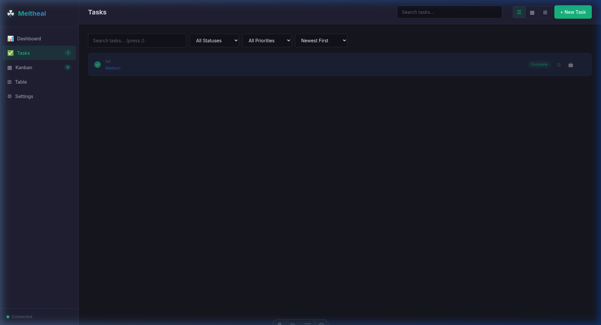
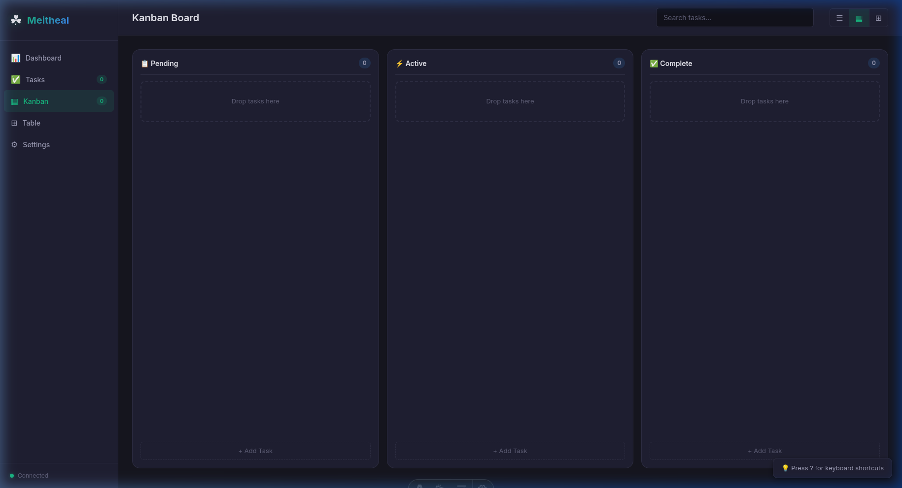
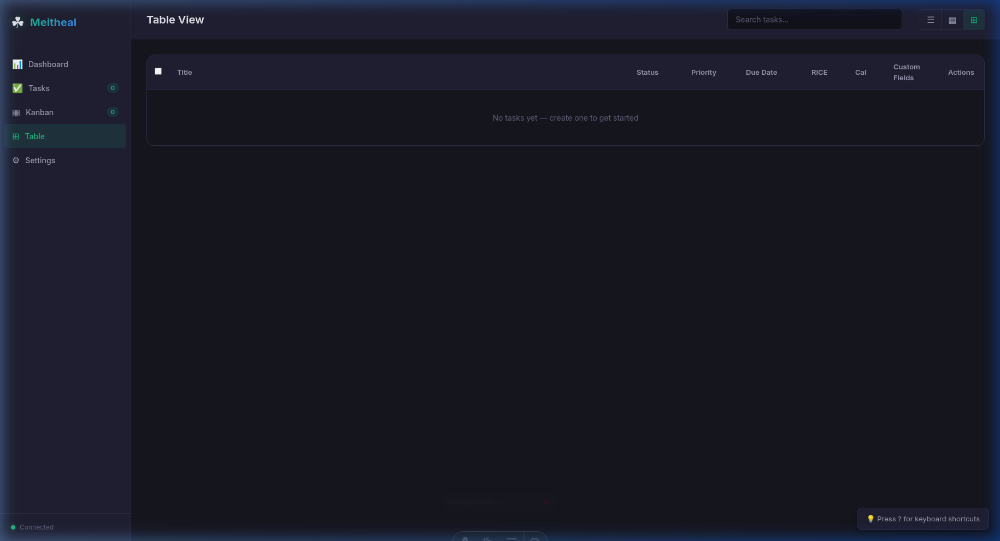
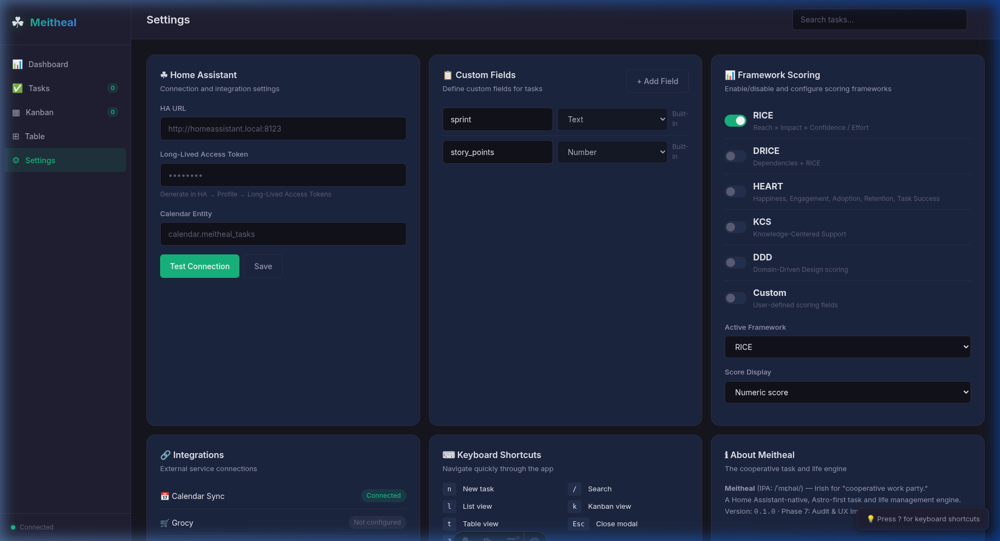

# Meitheal

The cooperative task and life engine for your home — with automatic HA calendar sync.

Repository target: `Coolock-Village/meitheal`.

Meitheal is an Astro-first, local-first life operating system for households, homelabs, and communities. It is designed to run natively as a Home Assistant app/add-on while also supporting Cloudflare deployment.

## Why Meitheal

In Ireland, a meitheal (pronounced meh-hal) is a tradition of neighbors sharing hard labor. You do not buy a meitheal; you show up, share the load, and return the favor.

Meitheal applies that ethos to software:

- The Hearth over The Cloud: local-first, resilient, private, fast.
- The Shared Burden: automation carries cognitive load across Home Assistant, Grocy, and calendars.
- Radical Pragmatism: Astro-native architecture, low memory footprint, strict performance budgets.
- Shared Knowledge: KCS culture where docs, runbooks, and ADRs evolve with code.

Source context for the term and community model:

- <https://www.universityofgalway.ie/cfrc/projects/completedprojects/preventionpartnershipandfamilysupportppfsprogramme/theworkpackageapproach/meithealandchildandfamilysupportnetworks/>

## Non-Negotiables

- Astro first/native architecture.
- Favor OSS Astro integrations from <https://astro.build/integrations/> when suitable.
- DDD boundaries, extensibility, and framework-driven behavior are core constraints.
- Released as a Home Assistant app/add-on and aligned with Home Assistant app ecosystem expectations: <https://www.home-assistant.io/apps/>
- Publishing posture remains aligned with Home Assistant developer guidance: <https://developers.home-assistant.io/docs/apps/publishing>

## Ubiquitous Language

- Meitheal: the system.
- The Hearth: Home Assistant host environment.
- Villagers: users/household members.
- Endeavors: high-level goals/portfolios.
- Tasks: units of work (not "issues").
- Frameworks: YAML-defined scoring and decision models (RICE, DRICE, HEART, KCS overlays).

## Monorepo Layout

- `apps/web`: Astro PWA frontend + API routes for HA runtime.
- `apps/api`: Cloudflare runtime adapter.
- `packages/domain-*`: pure domain logic.
- `meitheal-hub`: Home Assistant OS add-on package.
- `integrations/home-assistant`: custom component skeleton.
- `docs/`: ADRs, KCS runbooks, methodology docs, PRFAQ.
- `tests/e2e` and `tests/governance`: quality and policy gates.
- `public/.well-known`: WebMCP discovery artifacts.

## Logging and Observability

Meitheal uses a coordinated HA-compatible pipeline:

1. Structured JSON logs from app to stdout/stderr.
2. Home Assistant journal capture.
3. Grafana Alloy collector.
4. Loki storage/query.
5. Grafana dashboards and alerts.

See `docs/decisions/0002-target-architecture.md` and `meitheal-hub/rootfs/etc/alloy/config.river`.

## Legal and Licensing

Meitheal uses a dual-track strategy:

- `meitheal-core`: clean-room Astro-native implementation focused on first-party Meitheal UX and domain model.
- `meitheal-vikunja-adapter`: AGPL-compatible migration/bridge layer for compatibility with Vikunja-oriented ecosystems.

Initial repository license is AGPL-3.0 while boundaries are hardened.

See `docs/decisions/0001-legal-and-naming-strategy.md`.

## HA Ecosystem Interop

Meitheal ships both:

- an HA OS add-on runtime (`meitheal-hub`), and
- a Home Assistant custom component skeleton (`integrations/home-assistant`).

Calendar sync is automatic when running as an HA addon — Meitheal detects your calendar entities and syncs events bidirectionally (HA events → tasks, task due dates → calendar events). See `meitheal-hub/DOCS.md` for configuration.

### Voice & Assist Integration

Meitheal registers as an LLM API provider in Home Assistant, making task management available to any conversation agent (Gemini, OpenAI, Ollama).

**Quick setup:**

1. HA auto-discovers Meitheal on addon start → confirm in **Settings → Devices & Services**
2. Go to **Settings → Voice Assistants → [Your Agent] → Configure → LLM APIs** → select **"Meitheal Tasks"**
3. Expose `todo.meitheal_tasks` in **Settings → Voice Assistants → Expose**

**Example commands:**

- "What are my tasks?" — searches active tasks
- "Add buy groceries to my tasks" — creates a task
- "What's overdue?" — lists past-due tasks
- "What's on my plate today?" — shows today's agenda
- "Mark buy groceries as done" — completes by title

**8 LLM tools + 2 advanced:** search, create, complete, update, delete, get details, get overdue, get today's tasks, task summary, daily briefing, batch complete.

See `meitheal-hub/DOCS.md` for full tool reference and troubleshooting.

Interop design is informed by existing HA/Vikunja integration patterns, including:

- <https://github.com/joeShuff/vikunja-homeassistant>

## Screenshots

| Dashboard | Tasks | Kanban |
|-----------|-------|--------|
|  |  |  |

| Table | Settings |
|-------|----------|
|  |  |

## Feature Inventory

| Feature | Status | Competitor Parity |
| --- | --- | --- |
| Task CRUD (create/read/update/delete) | ✅ | Vikunja ✅ Trello ✅ |
| 3 views (list, kanban, table) | ✅ | Vikunja ✅ Trello ✅ |
| Drag-and-drop kanban | ✅ | Vikunja ✅ Trello ✅ |
| Priority levels (1-5) | ✅ | Vikunja ✅ Trello ❌ |
| Labels/tags | ✅ | Vikunja ✅ Trello ✅ |
| Quick Add Magic (#label, date parsing) | ✅ | Vikunja ✅ Trello ❌ |
| Duplicate task | ✅ | Vikunja ✅ Trello ✅ |
| Keyboard shortcuts (global) | ✅ | Vikunja ✅ Trello ✅ |
| Global search | ✅ | Vikunja ✅ Trello ✅ |
| Filter + sort (status, priority) | ✅ | Vikunja ✅ Trello ⚠️ |
| Framework scoring (RICE, HEART, KCS) | ✅ | Vikunja ❌ Trello ❌ |
| Kanban swimlane management | ✅ | Vikunja ❌ Trello ✅ |
| Native Data Export (JSON/CSV) | ✅ | Vikunja ⚠️ Trello ✅ |
| Raw SQLite DB Download | ✅ | Vikunja ❌ Trello ❌ |
| Settings Portability | ✅ | Vikunja ❌ Trello ❌ |
| Configurable settings | ✅ | Vikunja ✅ Trello ✅ |
| Dark mode | ✅ | Vikunja ✅ Trello ✅ |
| Home Assistant integration | ✅ | Vikunja ❌ Trello ❌ |
| Calendar sync (HA, bidirectional) | ✅ | Vikunja ✅ Trello ❌ |
| Vikunja compatibility layer | ✅ | N/A |
| OpenAPI spec | ✅ | Vikunja ✅ Trello ✅ |
| LLMs.txt | ✅ | Vikunja ❌ Trello ❌ |
| PWA service worker | ✅ | Vikunja ✅ Trello ✅ |
| Input sanitization | ✅ | Vikunja ⚠️ Trello ✅ |
| a11y (ARIA, semantic HTML) | ✅ | Vikunja ⚠️ Trello ✅ |
| Offline Image Attachments (IDB) | ✅ | Vikunja ❌ Trello ❌ |
| AI Context Routing (LLM) | ✅ | Vikunja ❌ Trello ❌ |
| HA Voice/Assist (8 LLM tools) | ✅ | Vikunja ❌ Trello ❌ |
| Voice Triggers (no LLM, accent-friendly) | ✅ | Vikunja ❌ Trello ❌ |
| MCP Server (live Model Context Protocol) | ✅ | Vikunja ❌ Trello ❌ |
| Proactive Notifications (overdue push) | ✅ | Vikunja ❌ Trello ❌ |
| Due-Date Reminders (configurable window) | ✅ | Vikunja ❌ Trello ❌ |
| Per-User Notification Preferences | ✅ | Vikunja ❌ Trello ✅ |
| Actionable Mobile Notifications | ✅ | Vikunja ❌ Trello ✅ |
| Strict Perf Budgets (CI) | ✅ | Vikunja ❌ Trello ❌ |
| Web Notifications (overdue/reminders) | ✅ | Vikunja ❌ Trello ✅ |
| Web Share API (native OS sharing) | ✅ | Vikunja ❌ Trello ✅ |
| Clipboard API (copy task URL/markdown) | ✅ | Vikunja ❌ Trello ✅ |
| Badging API (pending task count) | ✅ | Vikunja ❌ Trello ❌ |
| Haptic feedback (Vibration API) | ✅ | Vikunja ❌ Trello ❌ |
| Web Locks (sync safety) | ✅ | Vikunja ❌ Trello ❌ |
| Cross-tab sync (BroadcastChannel) | ✅ | Vikunja ❌ Trello ✅ |
| Web Vitals monitoring (PerformanceObserver) | ✅ | Vikunja ❌ Trello ❌ |
| Screen Wake Lock (focus mode) | ✅ | Vikunja ❌ Trello ❌ |
| OS theme detection (prefers-color-scheme) | ✅ | Vikunja ✅ Trello ✅ |
| Manifest shortcuts + share target | ✅ | Vikunja ❌ Trello ❌ |
| HA Companion App (Android/iOS) | ✅ | Vikunja ❌ Trello ❌ |
| Siri / Apple Watch / CarPlay | ✅ | Vikunja ❌ Trello ❌ |
| Device Triggers (HA automations) | ✅ | Vikunja ❌ Trello ❌ |
| HA Diagnostics download | ✅ | Vikunja ❌ Trello ❌ |
| Due-Date Reminder Scheduler | ✅ | Vikunja ❌ Trello ❌ |

## Local Container Testing

```bash
# Pull HA base image
podman pull ghcr.io/home-assistant/amd64-base:3.20

# Build from repo root
podman build --build-arg BUILD_FROM="ghcr.io/home-assistant/amd64-base:3.20" \
  -f meitheal-hub/Dockerfile -t local/meitheal-hub .

# Run standalone (no HA Supervisor)
podman run --rm --network=slirp4netns:port_handler=slirp4netns \
  -p 3333:3000 -v /tmp/meitheal-data:/data \
  local/meitheal-hub /run-local.sh

# Test health endpoint
curl http://localhost:3333/api/health
```

## API Documentation

- OpenAPI 3.0.3 spec: `public/openapi.yaml`
- LLMs.txt: `public/llms.txt`

## Status

60+ phases complete and container-verified:

1. ✅ Foundation & Vertical Slice — task→calendar sync, Vikunja compat
2. ✅ Integration Deepening — webhooks, Grocy, n8n
3. ✅ PWA & Offline-First — service worker, IndexedDB, background sync
4. ✅ Cloud Runtime — D1 adapter, dual-runtime detection
5. ✅ Market Parity — security hardening, domain events, GDPR, OpenAPI
6. ✅ Functional UI & Feature Parity — 3 persona loop iterations
7. ✅ UX Parity & Boards — multi-board management, swimlanes
8. ✅ Astro Optimizations & UX — performance tuning, responsive design
9. ✅ Full Persona Audit — accessibility, keyboard shortcuts, ARIA
10. ✅ Kanban Overhaul — drag-and-drop, column management, search
11. ✅ Data Export & Portability — JSON/CSV export, SQLite download, settings backup
12. ✅ AI Context & LLM Integration — 10 LLM tools, voice intents, MCP server
13. ✅ Offline Image Attachments — IDB blob storage, thumbnail rendering
14. ✅ Structured Logging & API Polish — 50-iteration sweep
15. ✅ i18n — Irish language support, locale framework
16. ✅ Web API Integration — 23 browser APIs, HA REST deepening, PWA enhancements
17. ✅ HA Smart Discovery — Supervisor Discovery API, hostname resolution, retry logic
18. ✅ Companion App — Android shortcuts/widgets, iOS Siri/Apple Watch/CarPlay, haptics
19. ✅ Notification System — multi-channel dispatch, due-date scheduler, mobile push
20. ✅ Security & Memory Hardening — CSRF fix, rate limiter caps, settings cache, OOM guards
21. ✅ HA Publishing Checklist — shared aiohttp session, DeviceInfo alignment, diagnostics

### HA Publishing Checklist Compliance

The custom component passes both HA publishing checklists:

- [Creating a component](https://developers.home-assistant.io/docs/creating_component_code_review)
- [Creating a platform](https://developers.home-assistant.io/docs/creating_platform_code_review)

| Requirement | Status |
|-------------|--------|
| Style guidelines (PEP8) | ✅ |
| Constants from `homeassistant.const` | ✅ (`CONF_HOST`, `CONF_PORT`) |
| Requirements in `manifest.json` | ✅ |
| Config flow (no YAML config) | ✅ |
| `hass.data[DOMAIN]` for state | ✅ |
| Event names prefixed with domain | ✅ (`meitheal_*`) |
| Entities extend proper base classes | ✅ (CoordinatorEntity + SensorEntity/TodoListEntity) |
| No I/O in properties | ✅ (cached via coordinator) |
| Lifecycle cleanup (`async_shutdown`) | ✅ |
| `has_entity_name = True` + `translation_key` | ✅ |
| Device grouping via `DeviceInfo` | ✅ |
| Diagnostics support | ✅ |
| HA shared aiohttp session | ✅ (`async_get_clientsession`) |
| Services with voluptuous schemas | ✅ |

### Key Metrics

- 80+ source files, 0 typecheck errors
- Container-tested on `ghcr.io/home-assistant/amd64-base:3.20`
- OpenAPI 3.0.3 specification (12+ routes)
- 10 LLM tools + 6 voice intents for HA Assist/Voice control
- 13 MCP tools at `/api/mcp`
- Live `llms-full.txt` with complete API reference
- HA Companion App: Android shortcuts + iOS Siri/Apple Watch
