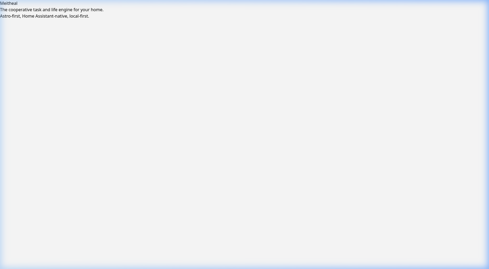

# Meitheal Hub Add-on

Meitheal Hub is the Home Assistant add-on runtime for Meitheal, the cooperative task and life engine for your home.

This add-on is Astro-first and runs the Meitheal web runtime with SQLite persistence and Home Assistant ingress support.

## Screenshots



*Meitheal Hub running in HA container*

## Local Testing

Per [HA local testing docs](https://developers.home-assistant.io/docs/add-ons/testing):

```bash
# Build from repo root
podman build --build-arg BUILD_FROM="ghcr.io/home-assistant/amd64-base:3.20" \
  -f addons/meitheal-hub/Dockerfile -t local/meitheal-hub .

# Run standalone (no Supervisor)
podman run --rm --network=slirp4netns:port_handler=slirp4netns \
  -p 3333:3000 -v /tmp/meitheal-data:/data \
  local/meitheal-hub /run-local.sh

# Verify
curl http://localhost:3333/api/health
```

## Files

| File | Purpose |
|------|---------|
| `config.yaml` | Add-on manifest (name, arch, ingress, options) |
| `Dockerfile` | Build steps — HA base image + Node + pnpm + pre-built dist |
| `build.json` | Architecture-specific base image registry |
| `run.sh` | Production entrypoint (uses bashio + Supervisor) |
| `run-local.sh` | Local testing entrypoint (standalone, no bashio) |
| `rootfs/` | Grafana Alloy config + dashboards |
| `DOCS.md` | Setup and operations details |

## Configuration

| Option | Type | Default | Description |
|--------|------|---------|-------------|
| `log_level` | `debug\|info\|warn\|error` | `info` | Logging verbosity |
| `log_redaction` | `bool` | `true` | Redact sensitive data in logs |
| `audit_enabled` | `bool` | `true` | Enable audit trail |
| `loki_url` | `str` | Loki add-on URL | Log aggregation endpoint |
